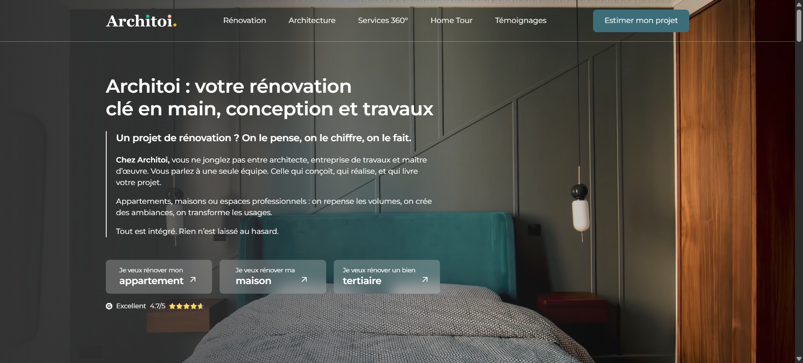
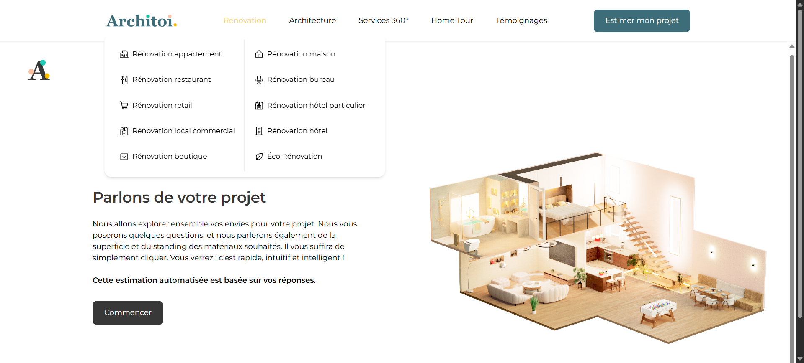

# Architoi — Site vitrine & estimateur de projet

Site vitrine WordPress consacré à l’architecture et à la rénovation, intégrant un formulaire multistep permettant aux visiteurs de décrire leur projet et d’obtenir une première estimation.

> Projet réalisé en sous-traitance et livré en marque blanche pour le compte du client donneur d’ordre. Le code source et les accès d’administration restent privés.

**[Voir le site en ligne →](https://www.architoi.com/)**

## Le projet

Architoi accompagne des projets de rénovation d’appartements, de maisons et d’espaces professionnels. Le site devait présenter clairement cette offre, valoriser les réalisations de l’entreprise et transformer les visites en demandes qualifiées.

Le projet a été développé sous WordPress à partir d’une maquette Figma fournie par le client. L’intégration reprend fidèlement la direction artistique tout en l’adaptant aux contraintes du web et aux différents formats d’écran.

Mon intervention a été réalisée en **marque blanche**, dans le cadre d’une mission de sous-traitance. J’ai pris en charge l’intégration et les développements demandés, tandis que la relation avec la marque finale et le pilotage commercial étaient assurés par le client donneur d’ordre.

## Objectifs

- reproduire précisément le design fourni sur Figma ;
- présenter les services et réalisations de manière claire ;
- proposer une navigation adaptée à la richesse des contenus ;
- offrir une expérience responsive sur ordinateur, tablette et mobile ;
- guider les visiteurs vers une demande d’estimation ;
- rendre le contenu administrable avec WordPress.

## Fonctionnalités principales

### Site vitrine

- page d’accueil immersive avec appels à l’action ;
- présentation des offres de rénovation et d’architecture ;
- pages dédiées aux appartements, maisons et locaux professionnels ;
- contenus éditoriaux et réalisations de type « Home Tour » ;
- témoignages et éléments de réassurance ;
- blog consacré à l’architecture, la décoration et la rénovation ;
- interface responsive fidèle à l’identité de la marque.

### Navigation par mégamenu

- accès direct aux différents types de rénovation ;
- organisation des nombreuses pages de services ;
- présentation en colonnes avec pictogrammes ;
- navigation claire sans multiplier les niveaux de menus.

### Estimateur multistep

Le principal élément interactif du site est un formulaire progressif conçu pour qualifier une demande de rénovation.

- présentation du parcours avant son démarrage ;
- questions réparties en plusieurs étapes courtes ;
- qualification du type de bien et de la nature du projet ;
- prise en compte de la surface et du niveau de finition souhaité ;
- progression guidée pour limiter l’abandon ;
- estimation automatisée à partir des réponses ;
- collecte structurée des informations nécessaires à la préparation du devis.

## Aperçu

### Estimateur de projet

### Mégamenu des services

### Mise en page éditoriale

## Environnement technique

| Domaine | Technologies et outils |
| --- | --- |
| CMS | WordPress |
| Construction des pages | Gutenberg, GenerateBlocks |
| Interface interactive | JavaScript, React Router |
| Animations et composants | Framer Motion, Swiper |
| SEO | Rank Math SEO |
| Mesure d’audience | Google Analytics 4, Hotjar, Meta Pixel |
| Relation client | HubSpot Chat |
| Conception | Maquettes Figma |

## Points techniques travaillés

- intégration WordPress fidèle à une maquette graphique détaillée ;
- création de composants et mises en page réutilisables ;
- développement d’un formulaire multistep orienté conversion ;
- gestion de l’état et de la navigation entre les étapes ;
- conception d’un mégamenu adapté à une arborescence importante ;
- adaptation responsive des compositions éditoriales riches ;
- intégration d’outils de mesure, de suivi et de contact ;
- maintien d’une structure administrable par l’équipe du site.

## Résultat

Le site associe une présence de marque soignée à un parcours de conversion concret. Les visiteurs peuvent découvrir les prestations et réalisations, puis décrire leur projet dans une interface guidée plutôt que de remplir un long formulaire traditionnel.

Le formulaire multistep transforme ainsi un site vitrine classique en véritable outil d’acquisition et de préqualification commerciale.

## Accès au code

Le code source est privé afin de protéger le travail réalisé pour le client et les configurations du site. Une présentation technique plus détaillée peut être proposée dans le cadre d’un recrutement ou d’une collaboration.

---

Réalisation technique en marque blanche : **Njakatiana Jacques Tsiorimalala**
