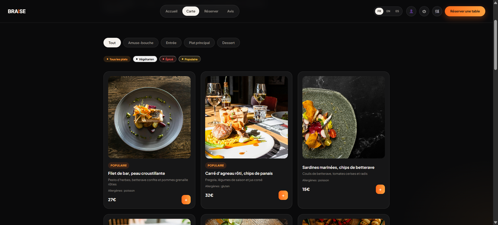
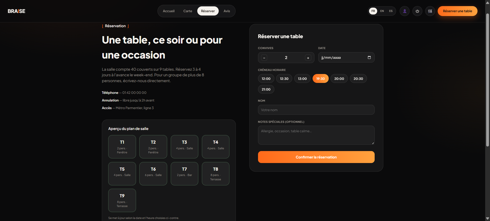
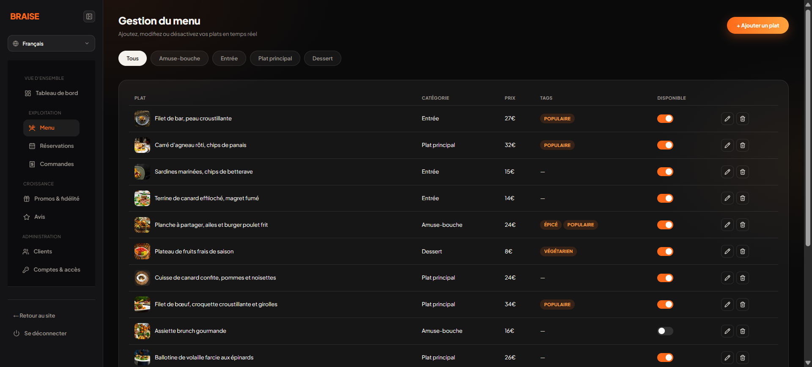
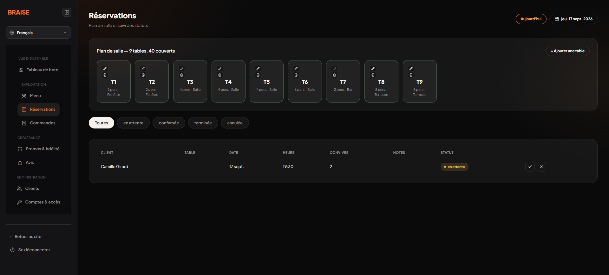
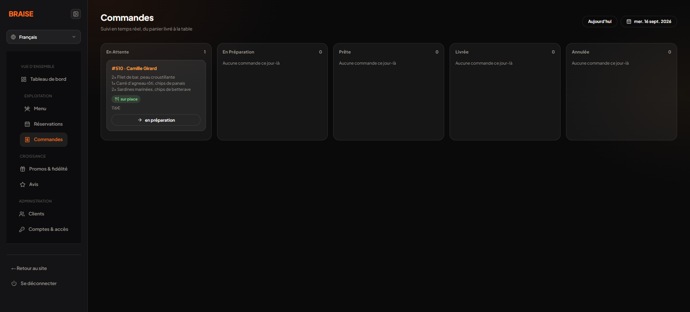
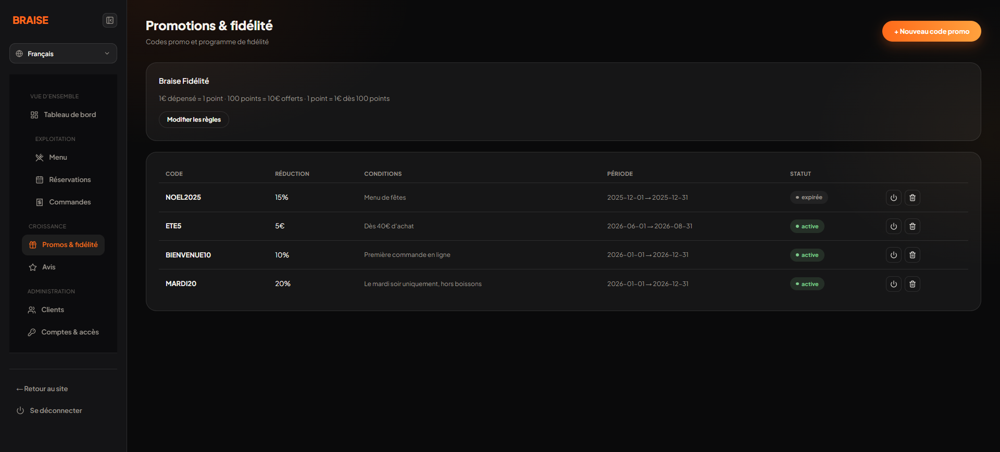
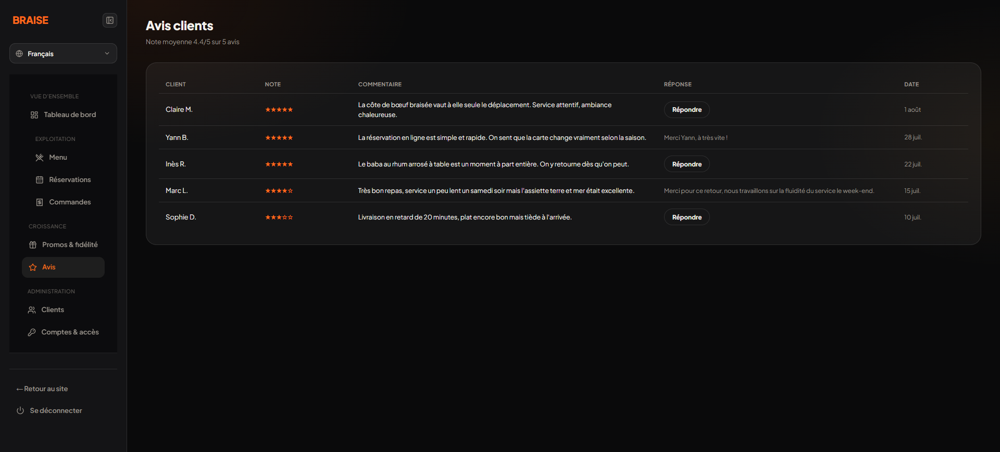

# Braise

Plateforme web complète pour un restaurant contemporain : découverte de la carte, réservation de table, commande en ligne et gestion quotidienne depuis un espace d’administration.

> Projet de démonstration — le code source est conservé dans un dépôt privé.

**[Voir la démonstration en ligne →](https://proto.restau.idigital-revolution.com/)**

## Le projet

Braise réunit dans une même expérience les besoins des clients et ceux de l’équipe du restaurant. Le site public privilégie une identité visuelle sombre et chaleureuse, avec une navigation simple sur ordinateur comme sur mobile. Le back-office centralise le suivi de l’activité et permet au personnel d’agir rapidement sur le menu, les réservations et les commandes.

Le produit est disponible en **français, anglais et espagnol**.

## Fonctionnalités principales

### Expérience client

- carte numérique organisée par catégories ;
- filtres par régime et caractéristiques des plats ;
- disponibilité des plats mise en évidence ;
- réservation avec choix du nombre de convives, de la date et du créneau ;
- aperçu du plan de salle ;
- panier et commande sur place, à emporter ou en livraison ;
- espace client pour retrouver commandes, réservations et points de fidélité ;
- dépôt et consultation d’avis ;
- interface responsive et navigation multilingue.

### Administration

- tableau de bord synthétique ;
- gestion des plats, catégories et disponibilités ;
- suivi des réservations et attribution des tables ;
- tableau de commandes organisé par statut ;
- gestion des promotions et du programme de fidélité ;
- modération des avis ;
- gestion des clients, utilisateurs et niveaux d’accès.

## Aperçu

### Réservation et plan de salle

### Espace client et fidélité

### Gestion du menu

### Suivi des réservations

### Suivi des commandes

### Promotions et fidélité

### Avis clients

## Architecture technique

| Couche | Technologies |
| --- | --- |
| Interface | Astro, JavaScript, CSS |
| API | Node.js, Express |
| Données | MySQL |
| Authentification | JWT, bcrypt |
| Déploiement | Docker, Docker Compose |
| Icônes | Lucide |

L’application sépare l’interface Astro d’une API REST Express. Les données métier couvrent notamment les utilisateurs, les rôles, les plats, les réservations, les commandes, les avis, la fidélité et les promotions. L’environnement Docker regroupe l’API et la base MySQL pour faciliter le déploiement.

## Points techniques travaillés

- conception d’un parcours cohérent entre réservation, commande et compte client ;
- déclinaison d’une même interface en trois langues ;
- gestion de plusieurs rôles et espaces fonctionnels ;
- modélisation des statuts métier pour les réservations et commandes ;
- adaptation responsive du catalogue et des parcours transactionnels ;
- séparation front-end, API et base de données ;
- préparation d’un environnement conteneurisé.

## Périmètre de la démonstration

Le paiement présenté dans l’interface est simulé : aucune donnée bancaire réelle n’est transmise. Les contenus, utilisateurs et opérations visibles dans les captures sont des données de démonstration.

## Accès au code

Le dépôt source est privé. Une présentation technique plus détaillée ou un accès encadré peut être fourni dans le cadre d’un recrutement ou d’une collaboration.

---

Conception et développement : **iDigital Revolution**
