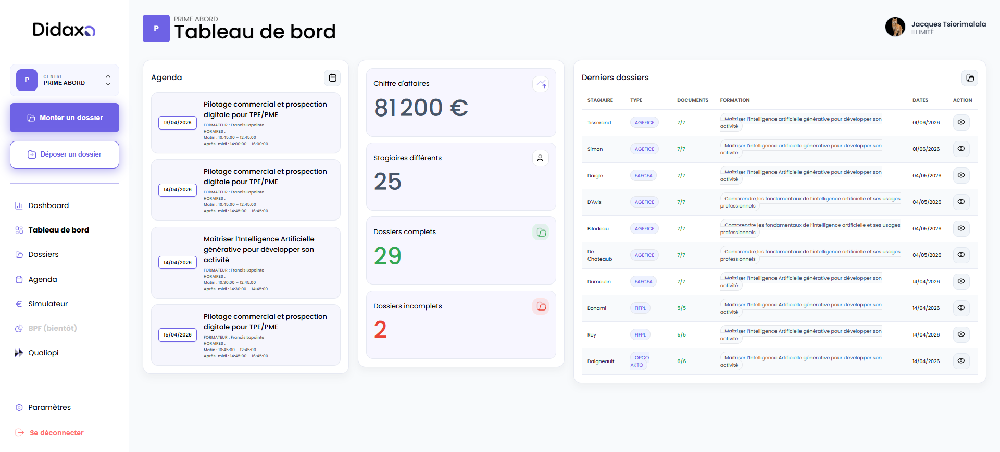
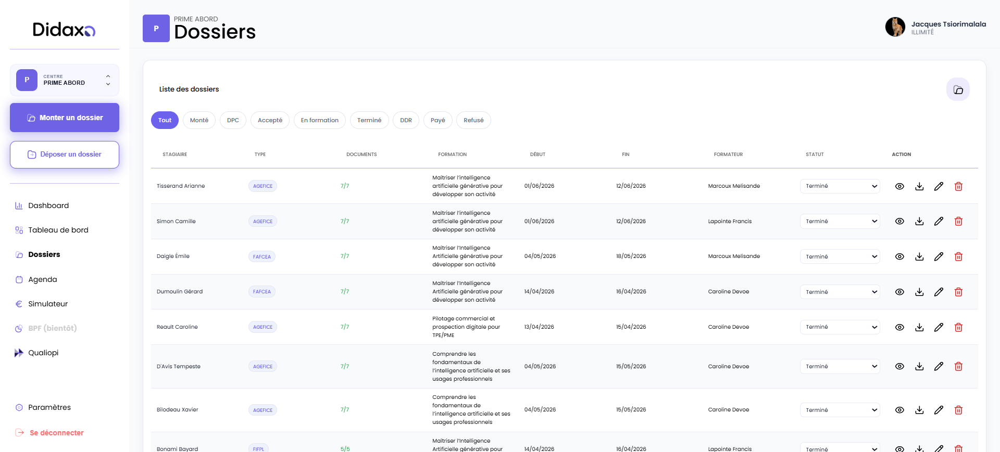
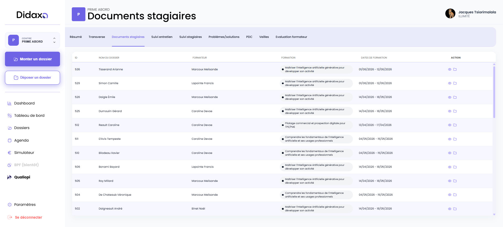
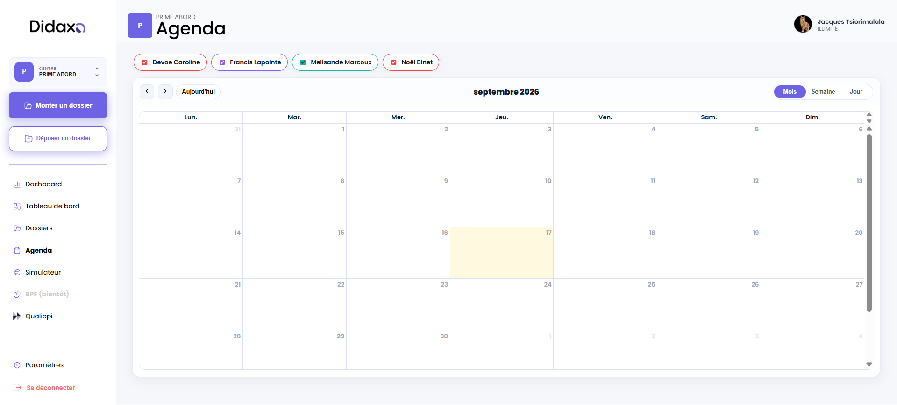

# Didaxo

SaaS métier conçu pour centraliser la gestion d’un organisme de formation, automatiser le montage des dossiers de financement et faciliter le suivi de la conformité Qualiopi.

> Le code source est conservé dans un dépôt privé.

**[Découvrir la plateforme →](https://saas.didaxo.fr/)**

## Le projet

Les organismes de formation doivent gérer de nombreuses données interdépendantes : stagiaires, formateurs, sessions, conventions, justificatifs, dossiers OPCO, indicateurs Qualiopi et Bilan Pédagogique et Financier.

Didaxo remplace les fichiers et modèles dispersés par une plateforme unique. Les informations sont saisies une fois, puis réutilisées dans les différents parcours métier et documents administratifs. L’objectif est de réduire la ressaisie, les erreurs et le temps consacré aux tâches répétitives.

## Fonctionnalités principales

### Pilotage de l’organisme

- tableau de bord adapté au profil connecté ;
- gestion de plusieurs organismes et personnalisation de leur espace ;
- suivi des dossiers en cours et de leur état d’avancement ;
- indicateurs d’activité et données financières ;
- gestion des utilisateurs et des droits d’accès.

### Gestion de la formation

- création et suivi des formations et sessions ;
- gestion des fiches stagiaires et formateurs ;
- association des participants, intervenants et entreprises ;
- agenda interactif avec vues calendrier ;
- espaces dédiés aux organismes, formateurs et stagiaires ;
- prise en charge de sessions à distance.

### Montage des dossiers de financement

- parcours guidé en plusieurs étapes ;
- préremplissage à partir des données déjà enregistrées ;
- gestion des informations de l’entreprise, du stagiaire, du formateur et de la formation ;
- prise en compte de différents financeurs et dispositifs ;
- génération de documents et dossiers PDF prêts à être contrôlés ou transmis ;
- suivi de quotas selon le forfait souscrit.

### Conformité et documents

- suivi des indicateurs Qualiopi ;
- centralisation des preuves et documents associés ;
- préparation du Bilan Pédagogique et Financier ;
- génération de conventions, convocations, attestations, calendriers et feuilles d’émargement ;
- modèles spécifiques à plusieurs parcours de financement.

### Abonnements SaaS

- gestion de plusieurs forfaits et niveaux d’accès ;
- abonnements et paiements récurrents avec Stripe ;
- changement de forfait avec calcul du prorata ;
- suivi des quotas de dossiers ;
- synchronisation et réconciliation des états d’abonnement ;
- gestion de la résiliation et des périodes d’accès restantes.

## Aperçu

### Tableau de bord

### Création d’un organisme de formation

### Gestion des dossiers

### Montage guidé d’un dossier

### Suivi Qualiopi

### Agenda

## Architecture technique

| Couche | Technologies |
| --- | --- |
| Interface | React 18, Vite, React Router |
| Agenda | FullCalendar |
| API | Node.js, Express |
| Données | MySQL |
| Authentification | JWT, bcrypt |
| Documents | Python, Flask, Jinja2, WeasyPrint, pypdf |
| Paiement | Stripe, webhooks et réconciliation |
| Services externes | API Pappers, calendrier des jours fériés |
| E-mails | Nodemailer |
| Déploiement | Docker, Docker Compose |

L’architecture repose sur trois briques distinctes :

1. une application React pour les différents espaces utilisateurs ;
2. une API REST Express qui porte l’authentification et les règles métier ;
3. un service Python spécialisé dans la composition et l’export de documents PDF.

Cette séparation permet de faire évoluer indépendamment l’interface, les traitements métier et le moteur documentaire.

## Points techniques travaillés

- modélisation d’un domaine réglementaire fortement relationnel ;
- contrôle des accès par rôle et par niveau d’abonnement ;
- automatisation de documents administratifs à partir de données structurées ;
- intégration Stripe avec webhooks, prorata et réconciliation ;
- enrichissement automatique des entreprises à partir de leur SIRET ;
- gestion de fichiers et pièces justificatives ;
- calcul et suivi des quotas d’utilisation ;
- tests automatisés des règles critiques liées aux forfaits et aux accès ;
- déploiement conteneurisé de plusieurs services ;
- mode maintenance pour sécuriser les mises en production.

## Enjeux du projet

La principale difficulté a été de traduire des processus administratifs complexes — Qualiopi, BPF et financements OPCO ou FAF — en parcours compréhensibles pour des utilisateurs non techniques. Le produit devait rester suffisamment structuré pour assurer la cohérence des dossiers, tout en conservant la souplesse nécessaire aux pratiques de différents organismes de formation.

## Résultat

Didaxo fournit un environnement de travail unifié couvrant le cycle de vie d’une action de formation : création des acteurs, planification, constitution du dossier, production documentaire, suivi réglementaire et gestion de l’abonnement.

Le projet couvre l’ensemble du cycle de développement d’un SaaS métier : cadrage fonctionnel, conception de l’architecture, développement full-stack, intégrations externes, tests, conteneurisation et déploiement.

## Accès au code

Le dépôt source est privé afin de protéger la logique métier, les intégrations et les données de configuration. Une présentation technique plus détaillée ou un accès encadré peut être fourni dans le cadre d’un recrutement ou d’une collaboration.

---

Conception et développement : **Jacques Tsiorimalala**
