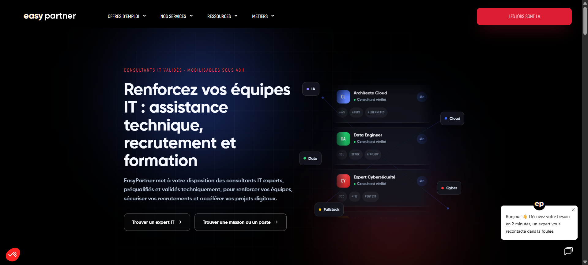
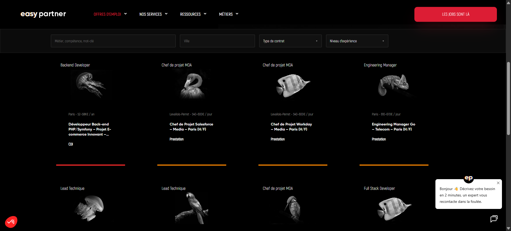

# EasyPartner — Refonte WordPress & Elementor

Refonte complète du site d’un cabinet spécialisé dans le recrutement, l’assistance technique et la formation IT. Le projet fait évoluer un thème WordPress historique développé en PHP vers une architecture plus facilement administrable avec Elementor, sans perdre les fonctionnalités métier existantes.

> Projet client en cours — le code source, les accès et les configurations d’intégration restent privés.

**[Voir le site en ligne →](https://easypartner.fr/)**

## Contexte

Le site existant reposait sur un thème WordPress fortement personnalisé. Cette architecture rendait les mises à jour de WordPress, de PHP et des extensions plus risquées, tout en compliquant les évolutions graphiques et l’adaptation aux différents formats d’écran.

La refonte vise à conserver l’identité visuelle et les contenus utiles du site tout en séparant clairement :

- la mise en page, désormais administrable avec Elementor ;
- le thème enfant, limité aux adaptations de présentation ;
- les fonctionnalités métier, déplacées vers des MU-plugins indépendants du thème ;
- les échanges avec HubSpot, isolés dans un module d’intégration dédié.

## Objectifs de la refonte

- moderniser le site sans interrompre son activité ;
- améliorer l’expérience sur mobile, tablette et ordinateur ;
- faciliter l’édition des pages par l’équipe interne ;
- préserver les contenus, les données et les URL importantes pour le SEO ;
- réduire la dépendance de la logique métier au thème graphique ;
- remplacer les anciens flux de recrutement par une intégration HubSpot plus robuste ;
- préparer une base maintenable pour les évolutions futures.

## Fonctionnalités principales

### Gestion des offres d’emploi

- types de contenus et taxonomies WordPress dédiés aux offres, métiers et catégories ;
- synchronisation des offres publiables depuis HubSpot ;
- mise à jour en temps réel par webhook et synchronisation planifiée ;
- filtres par mot-clé, ville, rayon, contrat et niveau d’expérience ;
- autocomplétion des villes et recherche géographique ;
- listes, cartes et carrousels d’offres réutilisables dans Elementor ;
- archivage et gestion du statut des offres.

### Parcours de candidature

- candidature directement depuis une offre ;
- formulaire de candidature spontanée en plusieurs étapes ;
- contrôle et transfert des informations du candidat ;
- téléversement du CV vers HubSpot ;
- création ou mise à jour du contact dans le CRM ;
- association de la candidature à l’offre et au recruteur concernés ;
- déclenchement des notifications et workflows HubSpot.

### Cooptation

- parcours dédié permettant de recommander un candidat ;
- génération d’un lien sécurisé associé à l’offre ;
- conservation des informations du cooptant et du candidat ;
- rattachement des données de cooptation au parcours de candidature.

### Administration avec Elementor

- reconstruction des pages avec Elementor Pro ;
- thème enfant basé sur Hello Elementor ;
- requêtes Elementor personnalisées pour afficher les offres selon leur contexte ;
- composants spécifiques pour les offres, formulaires et contenus dynamiques ;
- styles et comportements JavaScript adaptés à l’identité existante ;
- gestion des contenus structurés avec Advanced Custom Fields.

### SEO technique

- préservation des slugs et contenus stratégiques pendant la migration ;
- données structurées `JobPosting` en JSON-LD pour les offres ;
- gestion correcte des pages introuvables et suppression des soft 404 ;
- optimisation du chargement des polices et des ressources ;
- contrôle de la structure des pages produites avec Elementor ;
- maintien d’une architecture compatible avec l’indexation des offres.

## Aperçu

### Recherche et filtrage des offres

### Fiche d’une offre d’emploi

### Candidature depuis une offre

### Candidature spontanée guidée

## Architecture technique

| Couche | Technologies |
| --- | --- |
| CMS | WordPress |
| Construction des pages | Elementor Pro |
| Thème | Hello Elementor, thème enfant personnalisé |
| Logique métier | PHP, MU-plugins WordPress |
| Interface | JavaScript, AJAX, HTML, CSS |
| Données | WordPress, Advanced Custom Fields |
| CRM et recrutement | HubSpot API v3, Forms API, webhooks |
| Synchronisation | WP-Cron, endpoints REST, webhooks HubSpot |
| SEO | JSON-LD `JobPosting`, gestion des statuts HTTP |

## Stratégie de migration

La difficulté principale consiste à moderniser le site sans reproduire le couplage du thème historique. La migration est donc réalisée par couches :

1. inventorier les contenus, types de publications, taxonomies et champs ACF existants ;
2. rendre la logique métier indépendante du thème grâce aux MU-plugins ;
3. migrer et normaliser les données nécessaires aux offres d’emploi ;
4. connecter WordPress à HubSpot pour les offres et candidatures ;
5. reconstruire les interfaces avec Elementor et le thème enfant ;
6. vérifier les parcours fonctionnels, le responsive et la continuité SEO.

Cette organisation permet de remplacer progressivement l’ancien thème tout en limitant les risques sur un site déjà exploité en production.

## Points techniques travaillés

- reprise d’un code historique et analyse de ses dépendances ;
- migration progressive sans réécriture destructive des données ;
- séparation entre présentation et logique métier WordPress ;
- création de types de contenus et taxonomies personnalisés ;
- synchronisation bidirectionnelle avec un CRM externe ;
- traitement de formulaires et de fichiers côté serveur ;
- sécurisation des actions AJAX avec nonces et validation des entrées ;
- gestion de tâches planifiées et de webhooks ;
- conservation des acquis SEO pendant une refonte technique ;
- amélioration de la maintenabilité et de l’autonomie éditoriale.

## Résultat

La refonte transforme un thème PHP difficile à faire évoluer en une plateforme WordPress hybride : Elementor apporte la souplesse éditoriale, tandis que les fonctionnalités critiques restent encadrées par du code métier indépendant et versionnable.

Le site conserve ainsi ses parcours de recrutement spécifiques tout en bénéficiant d’une base plus moderne, responsive et adaptée aux futures évolutions du contenu et du CRM.

## Accès au code

Le dépôt source est privé afin de protéger le code client, les mécanismes de recrutement et les configurations HubSpot. Une présentation technique plus détaillée peut être proposée dans le cadre d’un recrutement ou d’une collaboration.

---

Refonte et développement : **Njakatiana Jacques Tsiorimalala**
