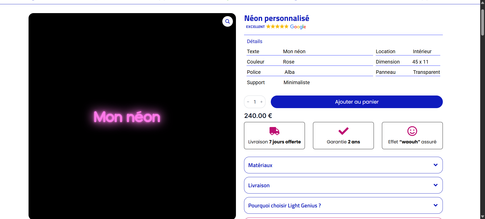

# Light Genius — Configurateur de néon personnalisé

Plugin sur mesure permettant aux clients de concevoir leur propre néon LED directement depuis le site Light Genius. L'outil transforme les choix de personnalisation en un aperçu visuel, calcule la configuration du produit et l'intègre au parcours de commande du site.

**Démo en ligne :** [lightgenius.fr/neon-personnalise](https://lightgenius.fr/neon-personnalise/)

## Contexte

Light Genius avait besoin d'un configurateur capable de rendre un produit entièrement personnalisable simple à comprendre et à commander. Le client peut visualiser son projet, essayer différentes combinaisons et retrouver tous ses choix sur la fiche produit avant l'ajout au panier.

J'ai développé la logique et l'interface de ce plugin avec **HTML, PHP, JavaScript et CSS**.

## Fonctionnalités développées

- saisie libre du texte du néon, avec gestion de plusieurs lignes ;
- choix de l'alignement du texte ;
- sélection parmi différentes typographies ;
- palette de couleurs prédéfinies et choix d'une couleur personnalisée ;
- sélection des dimensions du néon ;
- choix entre une installation intérieure ou extérieure ;
- sélection de la découpe du support ;
- choix de la couleur du panneau ;
- aperçu visuel actualisé en temps réel ;
- déplacement du néon dans la zone de prévisualisation ;
- changement du fond de l'aperçu afin de simuler différents environnements ;
- affichage dynamique du prix et des dimensions ;
- transmission de la configuration vers la fiche produit ;
- récapitulatif des options sélectionnées avant l'ajout au panier.

## Parcours utilisateur

1. Le client saisit le texte à fabriquer.
2. Il personnalise la police, la couleur, les dimensions et le support.
3. Le rendu est généré instantanément dans l'espace de prévisualisation.
4. Le prix et les dimensions sont recalculés selon la configuration.
5. La commande est préparée avec l'aperçu et le détail de chaque option.
6. Le produit personnalisé peut ensuite être ajouté au panier.

## Enjeux techniques

Le principal défi consistait à synchroniser une interface très interactive avec les règles commerciales du produit. Chaque modification devait mettre à jour immédiatement le rendu, les dimensions, le prix et les données envoyées au parcours d'achat.

Le plugin assure notamment :

- la gestion de l'état de toutes les options choisies ;
- la génération dynamique du rendu lumineux du texte ;
- l'adaptation de l'aperçu à la police, à la couleur et au format sélectionnés ;
- l'application des règles de tarification ;
- la validation des données avant la création du produit configuré ;
- le transfert fiable des options entre le configurateur et la commande ;
- une interface utilisable sur ordinateur comme sur mobile.

## Technologies

| Technologie | Utilisation |
| --- | --- |
| PHP | logique serveur, traitement et transmission de la configuration |
| JavaScript | interactions, aperçu en temps réel et calculs dynamiques |
| HTML | structure de l'interface du configurateur |
| CSS | mise en page, responsive design et rendu visuel du néon |
| WordPress | intégration du plugin au site existant |

## Captures d'écran

### Configurateur et aperçu en temps réel

### Récapitulatif avant l'ajout au panier

## Confidentialité

Le code source du plugin, les règles tarifaires détaillées et les données du client ne sont pas publiés dans ce dépôt. Cette fiche présente uniquement son fonctionnement et ses interfaces.

---

Développement du plugin : **Njakatiana Jacques Tsiorimalala**
