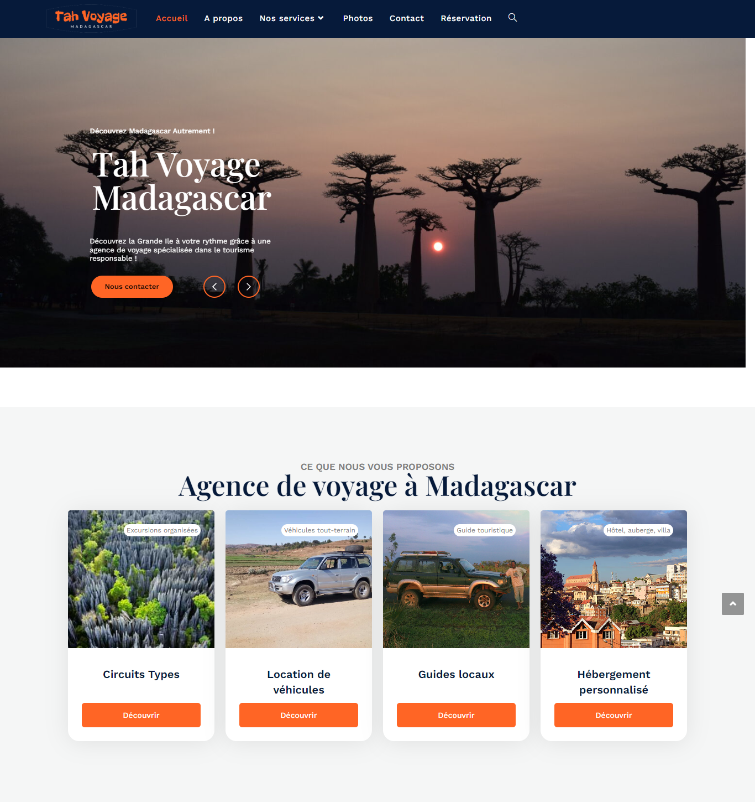

# Tah Voyage Madagascar — Refonte WordPress & SEO

Refonte complète du site web d'un tour-opérateur spécialisé dans les voyages à Madagascar. J'ai pris en charge l'ensemble du projet, depuis l'installation du CMS jusqu'à la conception des pages, la réécriture des contenus et leur optimisation pour les moteurs de recherche.

> Le site n'est plus en ligne. Cette page conserve une présentation du travail réalisé à partir de la capture disponible.

## Contexte

Le site existant devait être modernisé afin de mieux valoriser les circuits, les services et l'expertise locale de Tah Voyage Madagascar. La mission consistait à reconstruire le site sur WordPress, à revoir entièrement son identité visuelle et à produire des contenus plus clairs, engageants et adaptés au référencement naturel.

## Mon intervention

J'ai réalisé le projet de A à Z :

- installation et configuration de WordPress ;
- sélection, installation et paramétrage des extensions nécessaires ;
- mise en place du thème léger **Hello Elementor** ;
- création des pages et des composants avec **Elementor** ;
- conception d'une interface responsive adaptée à l'univers du voyage ;
- organisation des offres : circuits, location de véhicules, guides locaux et hébergements ;
- création de nouvelles pages destinées aux offres futures ;
- réécriture de l'intégralité des contenus ;
- optimisation SEO éditoriale, sémantique et technique des pages.

## Travail éditorial

Les textes ont été entièrement repris pour présenter l'agence, ses services et Madagascar de façon plus structurée. L'objectif était de concilier trois enjeux : informer les voyageurs, mettre en valeur les offres et répondre aux intentions de recherche liées au tourisme à Madagascar.

Le travail comprenait notamment :

- la définition d'un ton cohérent avec l'image de l'agence ;
- la hiérarchisation des informations importantes ;
- la reformulation des offres et des appels à l'action ;
- la rédaction de contenus lisibles, utiles et orientés conversion ;
- la préparation de contenus pouvant accueillir de futurs circuits et services.

## Optimisation SEO

L'optimisation a été intégrée à la conception du site et à la réécriture des contenus :

- recherche et intégration de requêtes pertinentes autour du voyage et des circuits à Madagascar ;
- structuration des pages selon les intentions de recherche des futurs voyageurs ;
- hiérarchie claire des titres `H1`, `H2` et `H3` ;
- rédaction de titres SEO et de méta-descriptions propres à chaque page ;
- création de contenus uniques, structurés et sémantiquement enrichis ;
- mise en place d'un maillage interne entre les services, les offres et les pages de destination ;
- optimisation des noms de fichiers, textes alternatifs et poids des images ;
- amélioration de la lisibilité et de l'expérience sur mobile ;
- vérification de l'indexabilité des pages et de la configuration générale du référencement WordPress.

## Technologies et compétences

| Domaine | Outils et méthodes |
| --- | --- |
| CMS | WordPress |
| Construction des pages | Elementor |
| Thème | Hello Elementor |
| Interface | Design responsive, HTML, CSS |
| Contenu | Rédaction web, architecture de l'information |
| Référencement | Recherche sémantique, SEO on-page, maillage interne, optimisation des images |

## Aperçu

## Confidentialité

Le code source, les accès d'administration et les données du client ne sont pas publiés dans ce dépôt. Cette fiche présente uniquement le périmètre de mon intervention et un aperçu visuel du résultat.

---

Conception, développement WordPress, rédaction et optimisation SEO : **Njakatiana Jacques Tsiorimalala**
