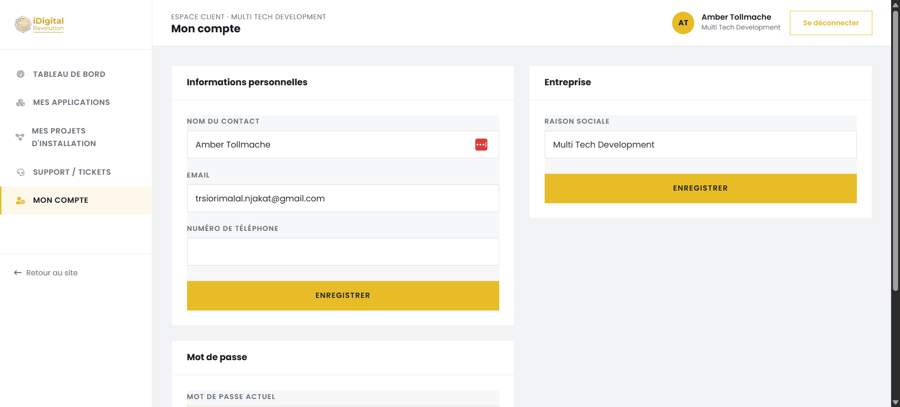
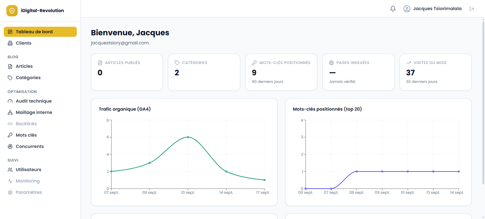
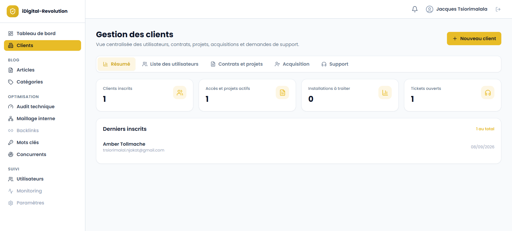

# iDigital Revolution

Plateforme de présentation, de vente et de suivi d’applications métier proposées en SaaS ou installées directement dans l’infrastructure du client.

> Le code source et les interfaces d’administration sont conservés dans des dépôts privés.

## Le projet

iDigital Revolution est une plateforme commerciale conçue pour distribuer plusieurs logiciels depuis un même écosystème. Elle associe un site public orienté acquisition, un catalogue de solutions, un espace client sécurisé et un back-office de gestion.

Chaque produit dispose de son propre positionnement, de ses fonctionnalités, de ses tarifs et de son mode de déploiement. La plateforme adapte ensuite le parcours : accès à une application SaaS, demande de proposition ou suivi d’une installation sur mesure.

## Deux modes de distribution

### SaaS accompagné

- application hébergée et maintenue par l’éditeur ;
- souscription à un forfait adapté au produit ;
- activation des droits depuis l’espace d’administration ;
- accès à l’application depuis un compte client unique ;
- pont SSO évitant une nouvelle authentification ;
- gestion du cycle de vie de la souscription.

### Installation sur mesure

- qualification du besoin avant activation ;
- proposition commerciale personnalisée ;
- choix d’options et de prestations complémentaires ;
- suivi du projet d’installation dans l’espace client ;
- déploiement et accompagnement jusqu’à la livraison.

## Fonctionnalités principales

### Site public

- page d’accueil présentant l’offre et les modes de distribution ;
- catalogue des applications disponibles ;
- filtres par catégorie, secteur et mode de déploiement ;
- pages détaillées pour chaque produit ;
- galeries, fonctionnalités, tarifs et options ;
- pages dédiées aux secteurs d’activité ;
- comparateur pouvant confronter jusqu’à trois solutions ;
- démonstrations accessibles pour les produits compatibles ;
- pages de tarifs, FAQ, contact et présentation de l’entreprise ;
- blog et contenus éditoriaux optimisés pour le référencement ;
- gestion du consentement aux cookies et pages légales.

### Comptes clients

- inscription avec validation de l’adresse e-mail ;
- connexion par session sécurisée ;
- réinitialisation du mot de passe par jeton temporaire ;
- modification du profil et du mot de passe ;
- séparation complète entre comptes clients et comptes administrateurs ;
- rattachement d’un visiteur anonyme à son compte après inscription.

### Espace client

- vue d’ensemble des applications actives ;
- accès direct aux SaaS autorisés ;
- suivi des abonnements et projets d’installation ;
- consultation des statuts et échéances ;
- suivi des options commandées ;
- formulaire authentifié de demande de devis ;
- gestion du profil de l’entreprise ;
- support intégré par tickets.

### Accès unifié aux applications

La plateforme agit comme point d’entrée vers les différents SaaS du catalogue. Lorsqu’un client ouvre une application :

1. son accès actif est vérifié côté serveur ;
2. un jeton signé de courte durée est généré ;
3. les droits liés au produit et au forfait sont transmis ;
4. l’application cible échange ce jeton contre sa propre session.

Ce mécanisme permet d’offrir une expérience unifiée sans partager directement les sessions ou les bases de données entre les produits.

### Support client

- création de tickets associés à un produit ;
- référence unique pour chaque demande ;
- fil de discussion entre le client et l’équipe ;
- suivi du statut du ticket ;
- compteurs persistants de messages non lus ;
- notifications côté administration ;
- historique conservé dans l’espace client.

### Back-office

- tableau de bord global ;
- gestion des clients et de leurs droits d’accès ;
- suivi des souscriptions SaaS et installations ;
- gestion des tickets de support ;
- notifications administratives ;
- gestion des articles, catégories et pages ;
- utilisateurs internes avec rôles distincts ;
- pilotage SEO, suivi des mots-clés et audit des pages.

Le module CRM et SEO du back-office est présenté séparément dans le Showcase afin de détailler ses fonctionnalités spécifiques.

### Acquisition et conversion

- suivi des consultations de démonstrations ;
- rattachement des événements au client après inscription ;
- suivi des demandes et souscriptions ;
- parcours différents selon le produit et son mode de vente ;
- formulaires de contact et demandes de devis ;
- inscription à la newsletter.

## Aperçu

### Tableau de bord client

### Gestion du compte

### Portail de support client

### Conversation liée à un ticket

### Tableau de bord d’administration

### Gestion centralisée des clients

### Traitement des tickets par l’administration

## Architecture technique

| Couche | Technologies |
| --- | --- |
| Site public et espace client | Astro 7, TypeScript, rendu SSR |
| Interface d’administration | React 18, Vite, React Router |
| Design admin | Tailwind CSS, Lucide React |
| API | Node.js, Express |
| Base de données | MySQL, Knex.js |
| Authentification | Sessions serveur, bcrypt, JWT pour le SSO |
| E-mails | Nodemailer |
| Données SEO | Google Search Console, Google Analytics 4 |
| Déploiement | Docker, Nginx |

L’écosystème est divisé en trois composants :

1. un frontend Astro qui sert le site public et l’espace client ;
2. une API Express centralisant les comptes, droits, contenus et flux métier ;
3. une interface React privée pour l’administration et le pilotage.

Les applications commercialisées restent indépendantes. Elles peuvent évoluer et être déployées séparément tout en utilisant la plateforme comme point central pour la découverte, la souscription et l’accès client.

## Choix techniques importants

- sessions distinctes pour les clients et les administrateurs ;
- cookies `HttpOnly`, `SameSite` et sécurisés en production ;
- validation de l’e-mail avant l’ouverture du compte client ;
- stockage des jetons sensibles sous forme hachée ;
- jetons SSO signés avec une durée de vie courte ;
- contrôle serveur des droits avant toute redirection vers un SaaS ;
- migrations versionnées avec Knex.js ;
- architecture catalogue extensible pour ajouter de nouveaux produits ;
- séparation entre données commerciales et données propres à chaque application.

## Points techniques travaillés

- conception d’une plateforme multi-produits ;
- coexistence des parcours SaaS et on-premise ;
- authentification centralisée sans couplage excessif ;
- gestion des droits application par application ;
- synchronisation entre souscriptions et accès clients ;
- support conversationnel avec notifications et messages non lus ;
- traçabilité du tunnel d’acquisition ;
- architecture full-stack séparant site, API, administration et SaaS externes ;
- intégration d’un CMS et d’outils SEO dans le même écosystème.

## Résultat

iDigital Revolution transforme un simple catalogue de logiciels en plateforme de distribution complète. Un prospect peut découvrir et comparer les solutions, créer son compte, suivre son projet et accéder aux applications autorisées depuis un espace unique.

Pour l’éditeur, le même système centralise les clients, les accès, le support, les contenus et le suivi commercial, tout en laissant chaque produit techniquement indépendant.

## Accès au code

Le code source est privé afin de protéger les accès, les données commerciales et les mécanismes de communication entre les différentes applications. Une démonstration technique encadrée peut être proposée dans le cadre d’un recrutement ou d’une collaboration.

---

Conception et développement : **Jacques Tsiorimalala**
